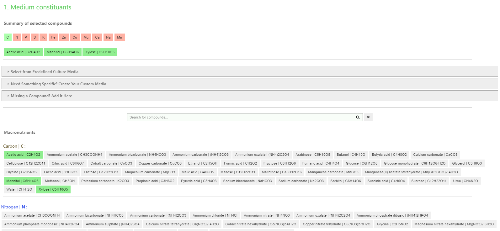
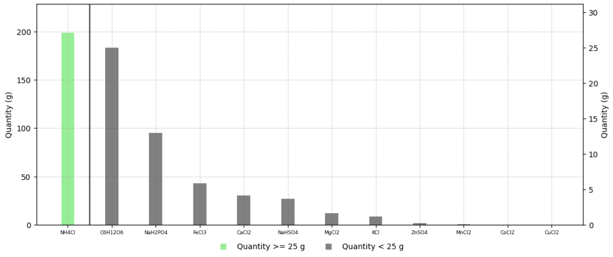

# OptiMetalIon
OptiMetalIon is a web-based application designed for optimizing metal ion concentrations to enhance microbial growth in biotechnological applications. Utilizing a user-friendly interface, it facilitates precise prediction of metal ion requirements for improved cell culture efficacy

**BASIC USAGE**:

1. Modify (if needed) the **maximum produced dry biomass** [g CDW/L]
2. Adjust (if needed) the **reference elemental growth yields** [g CDW/g element]
3. Adjust (if needed) the **excess factors** (i.e the factor multiplied by the reference elemental growth yield) 

**ADVANCED USAGE**:

4. **Add (if needed) a new compound** not present in the default database of compounds 
5. Select (if needed) the **preference of the compounds** (e.g. compound not available or expensive)
6. Select (if needed) a **minimum or maximum concentration** for the compounds (e.g. chelating agent present at a minimal concentration, a toxic compound present to a certain maximal concentration)

